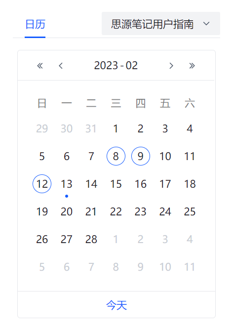

# arco-calendar

依赖arco design组件库开发的思源笔记日历插件



## 手动安装

- 复制 `calendar` 目录下的文件到你当前使用的思源主题目录下
- 在 `theme.js` 中引用入口文件 `calendar/main.js` 并运行 `calendarMain()` 函数
- 修改 `calendar/main.js` 第36行，改为你当前 `calendar` 文件夹所在路径

## 修改颜色

将以下代码插入 `index.html` 的 `<head>` 标签内,并自行修改颜色

```html
<style>
// 明亮模式的颜色即删除下行内的"[arco-theme='dark']"
body[arco-theme='dark'] {
    // 页面底色
    --color-bg-1: #21252b !important;
    // 下拉选择框输入时底色
    --color-bg-2: #21252b !important;
    // 下拉选择框底色 && 下拉菜单选项悬浮底色
    --color-fill-2: #323842 !important;
    --color-fill-3: #323842 !important;

    // 日历底色
    --color-bg-popup: #282c34 !important;
    // 非当月日期，有日记底色（r,g,b）
    --gray-1: 33, 37, 43 !important;
    // 当月日期，有日记底色（r,g,b,a）
    --arcoblue-1: 60, 126, 255, 0.2 !important;
}
</style>
```

## 参考与感谢

- [BryceAndJuly](https://github.com/BryceAndJuly) 在社区中的[首次实现](https://ld246.com/article/1662969146166)
- [HowcanoeWang/calendar](https://github.com/HowcanoeWang/calendar) 对上一项目的反编译以及功能拓展
- [九炎](https://github.com/leolee9086)大佬提供的 WebSocket 封装模板
